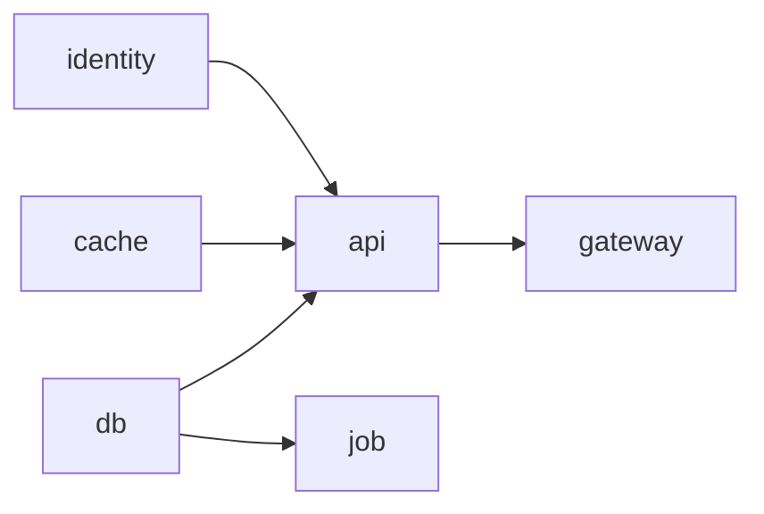

# 9. Dependency Model

**Part of the [Infrastructure as Prompt](../../README.md) · Version 1.0.0 · Status: Draft**

## 9.1 Order Is Derived, Never Declared

IaP documents **never express execution order**. There is no `order`, `phase`, `priority`, or `waitFor` field, no numbered steps, and no positional significance anywhere in a document: the `resources` map is unordered, and reordering its entries MUST NOT change any derived artifact. Execution order is always **derived** from the normalized relationship graph ([Chapter 4](04-relationship-model.md)). This is a deliberate consequence of the layer boundary ([Chapter 1](01-architecture.md)): authors state *what must exist and how it is related*; planners compute *when to act*.

## 9.2 Derivation Rules

Given the normalized edge set of [Chapter 4](04-relationship-model.md) §4.7, a conforming implementation derives the dependency graph as follows:

1. Every `dependsOn` edge contributes an ordering constraint: **target before source**. That is its entire meaning.
2. Every edge whose verb is a **semantic verb** — `connectsTo`, `routesTo`, `publishesTo`, `consumesFrom`, `storesDataIn`, `protectedBy`, `monitoredBy`, `authenticatedBy` — contributes the same implied constraint, *target before source*, in addition to its semantic assertion. A resource cannot connect to, route to, or authenticate with something that does not yet exist.
3. `replicatesTo` edges contribute **no** ordering constraint. Replication is symmetric-capable; the pair may be provisioned in either order or concurrently, and replication is configured once both exist.
4. Multiple constraints between the same pair of resources collapse to a single dependency arc.

The result is a directed graph over resource identifiers, called the **dependency graph**. It is a projection of the relationship graph: verbs and attributes are erased; only *must-exist-before* arcs remain.

## 9.3 The Dependency Graph MUST Be a DAG

The dependency graph MUST be acyclic. Any cycle among ordering arcs fails validation with **IAP401** (ordering cycle), reported with the full cycle path (e.g. `a → b → c → a`). Detection is a validation-phase obligation ([Chapter 8](08-validation.md)); a planner MUST NOT be handed a cyclic graph.

Note that cycles in the *relationship* graph are not themselves errors — two databases that `replicatesTo` each other form a relationship cycle but no ordering cycle, because rule 3 above contributes no arcs. Only cycles among **ordering** arcs are IAP401 errors.

## 9.4 Planner Obligations

Planners consume the dependency graph and MUST:

- compute a **topological ordering** of resources, acting on every dependency target before its source;
- exploit **maximal parallelism**: resources with no path between them in the dependency graph MAY be acted on concurrently, and a conforming planner SHOULD schedule them so (the "waves" below are the canonical presentation: wave *n* contains every node whose longest incoming path has length *n − 1*);
- derive teardown as the **reverse** of the same ordering;
- keep derivation **deterministic**: identical normalized graphs yield identical plans, with lexicographic resource-identifier order breaking all ties.

Execution-graph construction, failure handling, rollback, and drift reconciliation are specified in [Chapter 14](14-planning-model.md).

## 9.5 Rule Edges and Profile Merge Ordering

Ordering arcs derived from selector-based rule edges are indistinguishable from those derived from inline edges: a rule edge `{source: selector(tier=backend), type: monitoredBy, target: platform-alerts}` places `platform-alerts` before every matched backend resource.

Because selectors match against the **profile-merged** document, profile merge ([Chapter 6](06-profiles.md)) MUST happen **before** dependency derivation. A profile that adds a labeled resource thereby changes which rule edges fire, and hence the dependency graph; deriving dependencies from the unmerged document is non-conforming. The pipeline is fixed: *merge → normalize edges → derive dependencies → plan*.

## 9.6 Worked Example

```yaml
apiVersion: iap.dev/v1
metadata:
  name: checkout
resources:
  gateway:
    kind: Gateway
    spec:
      exposure: public
    relationships:
      - type: routesTo
        target: api
        path: /
        protocol: https
  api:
    kind: Service
    spec:
      artifact:
        type: container-image
        reference: registry.example.com/checkout-api:2.1.0
    relationships:
      - type: connectsTo
        target: db
        port: 5432
        protocol: tcp
        access: read-write
      - type: connectsTo
        target: cache
        port: 6379
        protocol: tcp
        access: read-write
      - type: authenticatedBy
        target: identity
  job:
    kind: Job
    spec:
      artifact:
        type: container-image
        reference: registry.example.com/checkout-migrate:2.1.0
    relationships:
      - type: dependsOn
        target: db
  db:
    kind: Database
    spec:
      class: relational
      engine: postgresql
  cache:
    kind: Cache
    spec:
      engine: redis-compatible
  identity:
    kind: Identity
```

Every edge here except `dependsOn` is a semantic verb, so each contributes both its assertion and a *target-before-source* arc. The derived dependency graph (arrows point **from dependency to dependent**, i.e. provision tail before head):



```
  db ───────┬──────────► api ────► gateway
  cache ────┤             ▲
  identity ─┘             │  (routesTo implies api before gateway)
  db ────────────────────►job
```

The graph is acyclic, so validation passes. A conforming planner derives these **execution waves** (maximal parallelism within each wave):

| Wave | Resources | Why |
|---|---|---|
| 1 | `db`, `cache`, `identity` | No incoming arcs; provision concurrently. |
| 2 | `api`, `job` | `api` needs `db`, `cache`, `identity`; `job` needs `db`. Independent of each other — run concurrently. |
| 3 | `gateway` | `routesTo api` implies `api` exists before traffic is routed to it. |

Teardown is the reverse: `gateway`, then `api` and `job`, then `db`, `cache`, `identity`. Had `job` instead declared `dependsOn: api` *and* `api` declared `dependsOn: job`, validation would fail with **IAP401** (`api → job → api`) before any plan is produced.
