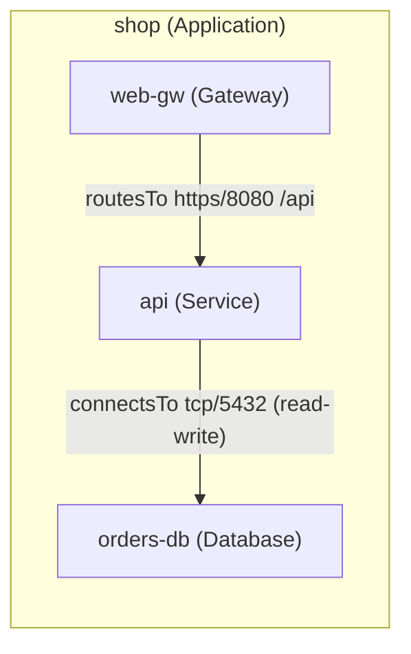
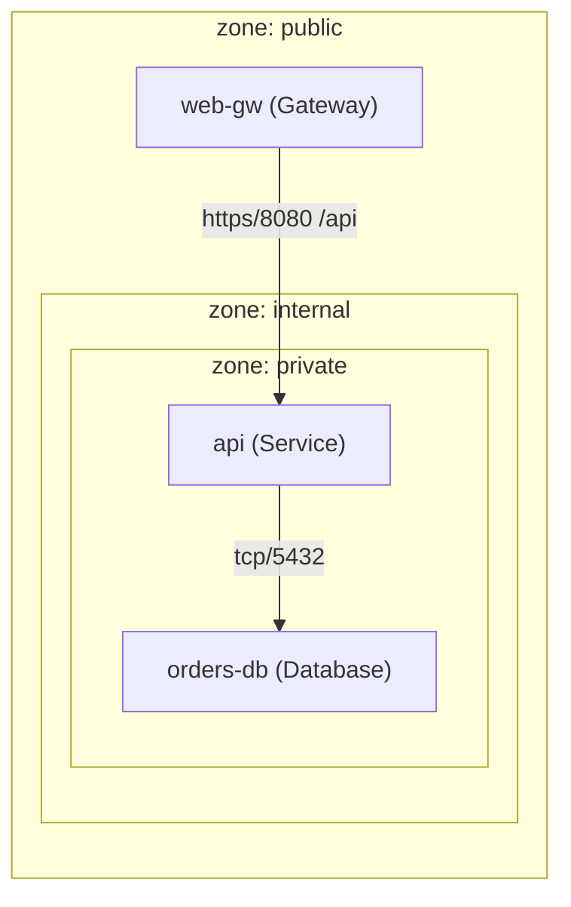

# 18. Architecture Model (Derived Views)

**Part of the [Infrastructure as Prompt](../../README.md) · Version 1.0.0 · Status: Draft**

This chapter specifies how architecture diagrams are produced from IaP documents. Its central rule is simple: **every diagram is a derived view of the normalized graph**. There is no diagram authoring surface in IaP, no diagram file format, and no way for a document to declare its own picture. If the document changes, the diagrams change; if the diagrams disagree with the document, the diagrams are wrong by definition.

## 18.1 Diagrams Are Derived, Never Drawn

A conforming diagram generator MUST derive every view deterministically from the **normalized graph** — the profile-merged, canonical-form document with its flattened edge set ([Chapter 1](01-architecture.md), [Chapter 4](04-relationship-model.md)). It MUST NOT consume the authored source directly, and it MUST NOT accept manual layout, grouping, or edge annotations as semantic input.

Manually drawn diagrams of a system described by an IaP document are **non-normative by definition**. They MAY exist as documentation, but no conformance property, review process, or tooling behavior may depend on them. The normalized graph is the single source of architectural truth; a derived view can therefore never be stale with respect to it, only with respect to an outdated document — which is a version-control problem, not a diagramming one.

Because derivation is a pure function of the canonical document, diagram generation participates in the determinism tests of [Chapter 24](24-conformance.md): the same canonical document MUST yield byte-identical diagram source (§18.3).

## 18.2 The Five Standard Views

A conforming diagram generator MUST support the five views below. Each view is defined by a **node rule** (which resources appear), an **edge rule** (which normalized edges appear and how they are labeled), and a **boundary rule** (which containers group nodes). All selection operates on the normalized graph only.

### 18.2.1 Architecture view

The general-purpose system picture.

- **Nodes:** every resource except `Application` resources (groupings are containers, not nodes).
- **Boundaries:** one container per `Application` resource, containing the nodes listed in its `spec.components`. Resources not referenced by any `Application` are rendered at the top level. A resource referenced by more than one `Application` is rendered inside the container of the lexicographically first such Application.
- **Edges:** every **semantic** edge — all verbs except `dependsOn`, which asserts nothing beyond ordering and appears only in the Dependency view. Edge labels follow the template of §18.3.

### 18.2.2 Dependency view

The provisioning-order picture.

- **Nodes:** every resource that participates in at least one ordering edge.
- **Edges:** the **derived ordering DAG** of [Chapter 9](09-dependency-model.md) — one edge per implied ordering dependency, drawn in provisioning direction: for each normalized edge `(source, type, target)` whose verb implies ordering, the view renders `target → source` ("target is provisioned before source"). `replicatesTo` edges never appear (they imply no ordering).
- **Boundaries:** none. The view MUST render a DAG; a document containing an ordering cycle fails validation (**IAP401**, [Chapter 4](04-relationship-model.md)) before any view can be derived.

### 18.2.3 Network view

The reachability and trust-zone picture.

- **Nodes:** every network-addressable resource — all kinds except `Application`, `Identity`, and `Secret`.
- **Boundaries:** the three exposure zones as **nested trust boundaries**, outermost to innermost: `public` ⊃ `internal` ⊃ `private`. All three zone containers are always emitted, in that nesting, even when a zone holds no direct nodes. Each node is placed in the zone named by its effective `exposure` after profile merge and defaulting (default `private`, [Chapter 3](03-resource-model.md)).
- **Edges:** `connectsTo` and `routesTo` edges only, labeled with `protocol/port` and, for routes, `path` and `host` when present. Because `connectsTo` is the sole source of reachability ([Chapter 4](04-relationship-model.md)), this view is a complete and exact rendering of permitted network flows.

### 18.2.4 Security view

The identity and protection picture.

- **Nodes:** every `Identity`, `Secret`, and `Certificate` resource, plus every resource that is an endpoint of an `authenticatedBy` or `protectedBy` edge or of an access-carrying edge.
- **Edges:** `authenticatedBy` and `protectedBy` edges, plus every edge carrying an `access` attribute (`connectsTo`, `storesDataIn`), labeled with the **derived access level** exactly as computed by the least-privilege derivation of [Chapter 15](15-security-model.md).
- **Badges:** each node whose effective spec resolves `encryption.atRest` or `encryption.inTransit` carries a textual encryption badge, e.g. `[atRest: required]` `[inTransit: required]`. Badges are derived from resolved values (including defaults), never from the authored text.

### 18.2.5 Application view

The scoped picture: one diagram **per `Application` resource**.

- **Nodes:** the Application's `spec.components`, plus any external resource that is the endpoint of an edge crossing the Application boundary. External nodes MUST be visually distinguished (dashed styling) and MUST NOT be expanded further.
- **Edges:** every semantic edge whose source or target is a component.
- **Boundaries:** a single container for the Application itself.

## 18.3 Rendering Contract

**Determinism.** For a fixed canonical document and view, a conforming generator MUST emit byte-identical textual diagram source on every invocation. The layout inputs are fully specified:

1. Nodes are emitted in lexicographic order of resource identifier (byte-wise on UTF-8), within their container.
2. Containers are emitted in lexicographic order of their grouping key (Application identifier; for the network view, the fixed nesting `public`, `internal`, `private`).
3. Edges are emitted in the normalized edge order of [Chapter 4](04-relationship-model.md) §4.7 step 6.
4. Node display labels follow the template `<resource-id>` + `(<Kind>)`; edge labels follow `<verb>` + `<protocol>/<port>` + `<path>` + `(<access>)`, each element present only when the corresponding attribute is present (the network view omits the verb; the dependency view uses no labels).

**Output formats.** A conforming generator MUST support at least one **textual** diagram source format from: Mermaid, DOT. It MAY support both and MAY support additional textual formats. Rasterization and vector rendering (PNG, SVG, PDF) are tool-specific and out of scope: the conformance artifact is the textual source, because text is diffable, reviewable, and hashable. Two renderers MAY draw the same source differently; they MUST NOT disagree about nodes, edges, labels, or containment.

**Extension styling is cosmetic only.** Extensions ([Chapter 11](11-extension-framework.md)) MAY contribute icons, colors, and shape styling per kind or per namespace. Such contributions MUST NOT add, remove, relabel, or regroup nodes, edges, or boundaries — a diagram stripped of all extension styling depicts the identical graph. This is the diagramming corollary of the Extension Non-Interference Rule.

## 18.4 Worked Example

The following document declares a gateway, a service, and a database grouped into one application:

```yaml
apiVersion: iap.dev/v1
metadata:
  name: shop
resources:
  shop:
    kind: Application
    spec:
      components: [api, orders-db, web-gw]
  web-gw:
    kind: Gateway
    spec:
      exposure: public
      domains: [shop.example.com]
    relationships:
      - type: routesTo
        target: api
        port: 8080
        protocol: https
        path: /api
  api:
    kind: Service
    spec:
      artifact:
        type: container-image
        reference: registry.example.com/shop-api:2.1.0
    relationships:
      - type: connectsTo
        target: orders-db
        port: 5432
        protocol: tcp
        access: read-write
  orders-db:
    kind: Database
    spec:
      class: relational
      engine: postgresql
```

**Derived architecture view (Mermaid).** Nodes sorted lexicographically inside the `shop` container; edges in normalized order (`api` before `web-gw`):



**Derived network view (Mermaid).** `web-gw` declares `exposure: public`; `api` and `orders-db` default to `private`. The three trust zones nest outermost to innermost; only `connectsTo`/`routesTo` edges appear, labeled `protocol/port`:



Any conforming generator, given this document and these two views, MUST emit exactly these node sets, edge sets, labels, and containment — and, for a given output format, byte-identical source.
